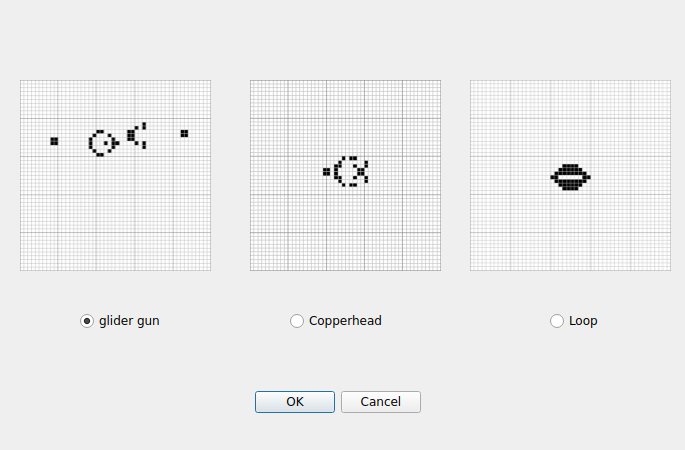
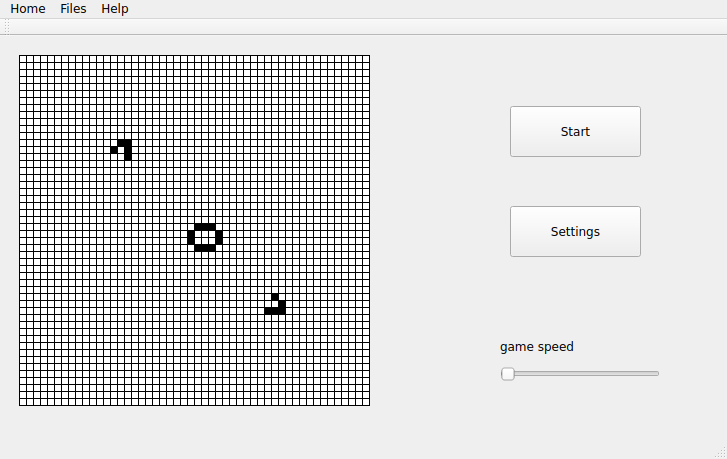

# GameOfLife

GameOfLife 是一个基于 Qt 6 和 C++17 开发的康威生命游戏桌面程序。程序提供 50 x 50 的细胞棋盘，支持手动绘制初始状态、从内置模板生成初始状态、从 CSV 文件导入棋盘，并可以在运行过程中调整演化速度和生命规则。

## 功能介绍

- 生命游戏模拟：按照当前生存规则自动更新细胞状态。
- 手动绘制棋盘：点击格子即可切换细胞的生/死状态。
- 模板生成：内置 Glider Gun、Copperhead、Loop 三种初始模板。
- 文件导入：从 CSV 文件读取 50 x 50 棋盘状态。
- 文件保存：将当前棋盘保存为 CSV 文件，便于后续再次导入。
- 速度调节：通过主界面的滑块调整模拟刷新速度。
- 自定义规则：可设置细胞存活和繁殖所需的邻居数量范围。
- 帮助提示：选择模式页和主界面均提供基础操作说明。

## 程序界面截图

### 模式选择页


### 模板选择页



### 主界面



## 项目结构

```text
GameOfLife/
├── CMakeLists.txt              # CMake 构建配置
├── inc/                        # 头文件
├── src/                        # C++ 源文件
├── resources/                  # Qt UI、qrc 资源和图片
│   ├── *.ui                    # Qt Designer 界面文件
│   ├── GameOfLife.qrc          # Qt 资源文件
│   ├── images/                 # 模板图片资源
│   └── screenshots/            # 程序界面截图
└── README.md                   # 项目说明文档
```

## 环境要求

- CMake 3.16 或更高版本
- 支持 C++17 的 C++ 编译器
- Qt 6，必须包含 `Widgets` 模块

## Windows 运行方法

以下示例以 Qt 安装在 `C:\Qt`、Qt Kit 为 `msvc2019_64` 为例。实际版本号和 Kit 名称请根据本机 Qt 安装目录调整。

1. 安装依赖：

   - Qt 6
   - CMake
   - Visual Studio 2019/2022 或 Visual Studio Build Tools

2. 配置并构建：

   ```powershell
   cd E:\GameOfLife
   cmake -S . -B build-win -DCMAKE_PREFIX_PATH=C:\Qt\6.5.3\msvc2019_64
   cmake --build build-win --config Release
   ```

3. 部署 Qt 运行库：

   ```powershell
   C:\Qt\6.5.3\msvc2019_64\bin\windeployqt.exe build-win\Release\GameOfLife.exe
   ```

4. 运行程序：

   ```powershell
   .\build-win\Release\GameOfLife.exe
   ```

如果使用 MinGW 版本 Qt，请将 `CMAKE_PREFIX_PATH` 和 `windeployqt.exe` 路径改为对应的 MinGW Qt 目录。

## Linux 运行方法

以下示例以 Ubuntu 为例，先通过命令行下载 Qt Online Installer，再使用 CMake 构建项目。

1. 安装基础命令和编译环境：

   ```bash
   sudo apt update
   sudo apt install curl build-essential cmake libgl1-mesa-dev libglu1-mesa-dev libglut-dev
   ```

2. 下载 Qt Online Installer：

   ```bash
   curl -OL https://download.qt.io/official_releases/online_installers/qt-online-installer-linux-x64-online.run
   ```

3. 添加执行权限并启动安装器：

   ```bash
   chmod +x qt-online-installer-linux-x64-online.run
   ./qt-online-installer-linux-x64-online.run
   ```

   安装时选择 Qt 6，并建议安装 Desktop gcc 64-bit 组件。假设安装路径为 `/opt/Qt`，Qt Kit 路径可能类似：

   ```text
   /opt/Qt/6.8.1/gcc_64
   ```

4. 配置并构建：

   ```bash
   cd GameOfLife
   cmake -S . -B build-linux -DCMAKE_PREFIX_PATH=/opt/Qt/6.8.1/gcc_64
   cmake --build build-linux
   ```

5. 运行程序：

   ```bash
   ./build-linux/GameOfLife
   ```

如果系统通过包管理器安装了 Qt 6，也可以使用系统路径，例如安装 `qt6-base-dev` 后直接运行：

```bash
cmake -S . -B build-linux
cmake --build build-linux
./build-linux/GameOfLife
```

## macOS 运行方法

1. 安装依赖：

   ```bash
   brew install cmake qt
   ```

2. 配置并构建：

   ```bash
   cd GameOfLife
   cmake -S . -B build-macos -DCMAKE_PREFIX_PATH="$(brew --prefix qt)"
   cmake --build build-macos
   ```

3. 运行程序：

   ```bash
   open build-macos/GameOfLife.app
   ```

也可以直接运行可执行文件：

```bash
./build-macos/GameOfLife.app/Contents/MacOS/GameOfLife
```

## 使用说明

1. 启动后先在模式选择窗口中选择初始棋盘生成方式：
   - `Draw the board`：手动绘制棋盘。
   - `Select from template board`：选择内置模板。
   - `Select from files`：从 CSV 文件导入棋盘。
2. 进入主界面后，点击 `Start` 开始演化，点击 `Pause` 暂停。
3. 可在任意时刻点击棋盘格子切换细胞状态。
4. 通过 `game speed` 滑块调整模拟速度。
5. 点击 `Settings` 打开规则设置窗口，修改细胞存活和繁殖条件。
6. 通过菜单 `Files` -> `save board` 保存当前棋盘。
7. 通过菜单 `Home` -> `Go back to home page` 返回模式选择页。
8. 通过菜单 `Home` -> `Exit` 退出程序。

## CSV 文件格式

CSV 文件用于保存或导入棋盘状态。程序按最多 50 行、每行最多 50 列读取数据：

- `1` 表示活细胞。
- `0` 表示死细胞。
- 同一行中的数字使用英文逗号 `,` 分隔。

示例：

```csv
0,0,0,0,0
0,0,1,0,0
0,0,1,0,0
0,0,1,0,0
0,0,0,0,0
```

## 常见问题

### CMake 找不到 Qt6

请确认已经安装 Qt 6，并在配置时指定 `CMAKE_PREFIX_PATH`：

```bash
cmake -S . -B build -DCMAKE_PREFIX_PATH=/path/to/Qt/6.x.x/compiler
```

Windows 示例：

```powershell
cmake -S . -B build-win -DCMAKE_PREFIX_PATH=C:\Qt\6.5.3\msvc2019_64
```

### Windows 运行时提示缺少 Qt DLL

构建完成后使用 Qt 自带的 `windeployqt` 部署依赖：

```powershell
C:\Qt\6.5.3\msvc2019_64\bin\windeployqt.exe build-win\Release\GameOfLife.exe
```

### Linux 运行时报 Qt 平台插件错误

请确认 Qt 运行环境安装完整，并检查 `QT_PLUGIN_PATH`、`LD_LIBRARY_PATH` 或系统 Qt 包是否配置正确。使用官方 Qt 安装器时，建议通过对应 Qt Kit 的路径重新配置并构建项目。
